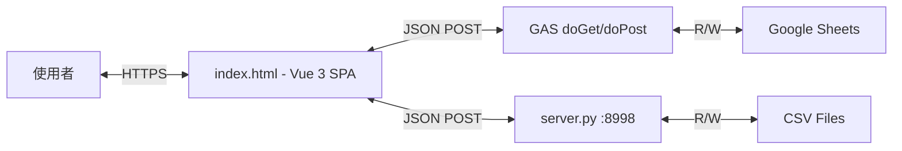

# 工程規格書: 工作管理表 Web App v2.2

## 1. 系統架構



### ADR: 為何單檔 SPA？
- **Decision**: 所有前端邏輯放在單一 `index.html` (~2400 行)
- **Alternatives**: Vite + 組件化 (需 build step)、多頁 MPA
- **Reasoning**: GAS 部署限制只能 serve 單一 HTML，CDN 載入 Vue/Tailwind 無需 build

## 2. 資料模型

### 2.1 工作項目 (data.csv)
```
uuid        | String   | 唯一識別碼
status      | String   | 原始狀態文字 (e.g. "執行", "完成")
project_code| String   | 專案代號 (e.g. "DC3551HT")
bu          | String   | 事業部 (由 project_code 反查)
task_name   | String   | 事項名稱
start_date  | String   | 開始日 (YY/MM/DD)
due_date    | String   | 預定完成日 (支援多行版本歷史)
complete_date| String  | 完成日 (YY/MM/DD)
remark      | String   | 備註
re          | String   | 週期性標記 (W/M/空)
```

### 2.2 專案設定 (project.csv)
```
Code   | String | 專案代號
Status | Enum   | W=進行中, O=完成, X=暫停
BU     | String | 所屬事業部
```
> **Order 自動規則**: 載入時 O→98, X→99, W→原值或預設50

### 2.3 BU 設定 (bu.csv)
```
BU    | String | 事業部名稱
Order | Number | 顯示順序 (拖拉自動更新)
```

### 2.4 狀態設定 (status.csv)
```
Status    | String | 狀態名稱 (e.g. "執行", "完成")
BgColor   | String | 背景色 hex
TextColor | String | 文字色 hex
Order     | Number | 顯示順序
```

## 3. API 規格

### 3.1 GAS Mode
| Method | Action | Body |
|:---|:---|:---|
| GET | `?action=read&sheet=data` | — |
| POST | `saveData` | `{action:"saveData", data:[...]}` |
| POST | `saveConfig` | `{action:"saveConfig", config:{bu:[...], project:[...], status:[...]}}` |

### 3.2 Local Mode (server.py)
| Endpoint | Method | 說明 |
|:---|:---|:---|
| `/` | GET | Serve index.html |
| `/api/data` | GET | 讀取 data.csv + config CSVs |
| `/api/save` | POST | 寫入 data.csv |
| `/api/save-config` | POST | 寫入 bu/project/status CSVs |

## 4. 核心演算法

### 4.1 倒數天數計算
```
if (已完成) → due_date - complete_date → "超過N日" / "提前N日" / "準時完成"
if (進行中) → due_date - today → 正=倒數, 負=逾期
```

### 4.2 Config Normalize (case-insensitive)
```
BU header: BU || Bu || bu → newItem.BU
Project Order: O→98, X→99 (自動修正)
```

### 4.3 篩選器 (Cascade Filter)
- 多欄位獨立篩選 (status, project_code, bu)
- 群組單位: BU > Status Category > 個別項目
- 支援排除模式 (filterExclusions)

## 5. 前端結構

| 區域 | 功能 |
|:---|:---|
| Header | 標題、新增按鈕、篩選器、儲存按鈕 |
| Filter Bar | 多欄位下拉篩選 (含清除) |
| BU Sections | 可摺疊 BU 群組 |
| Data Table | Sticky 狀態欄、倒數顯示、行點擊編輯 |
| Edit Modal | 表單編輯 (含日期版本歷史) |
| Settings Modal | Status/Project/BU 三頁簽設定 |
